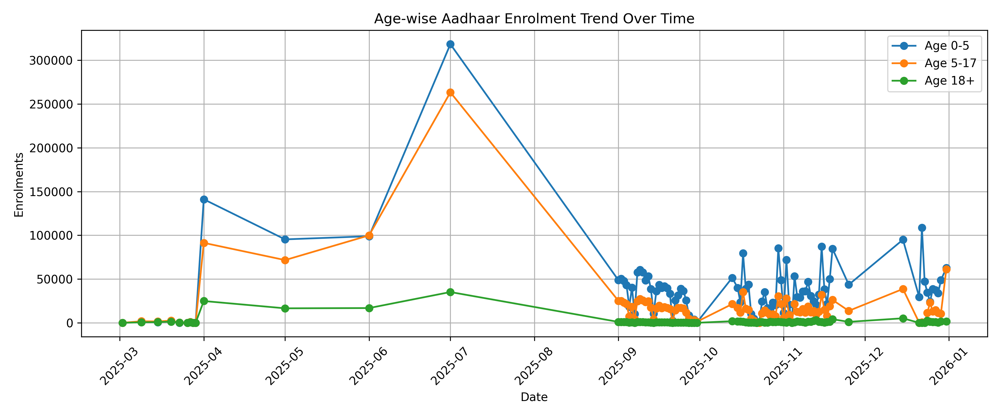
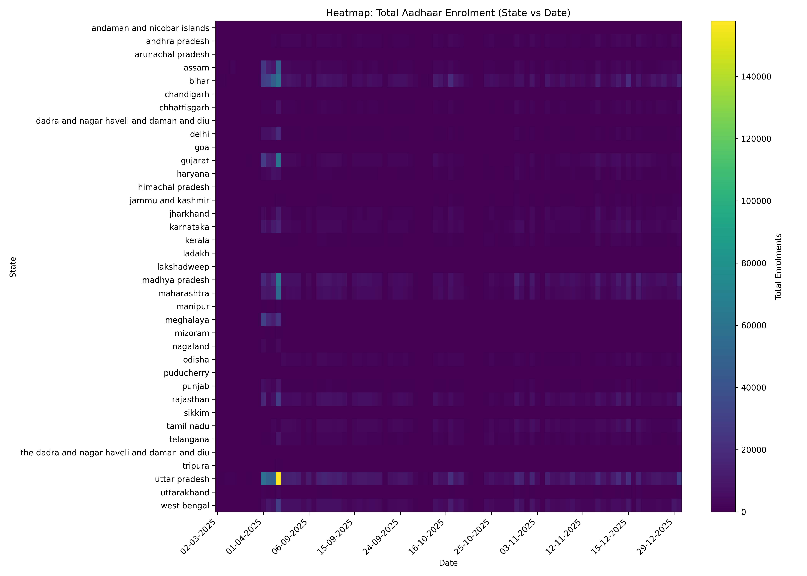
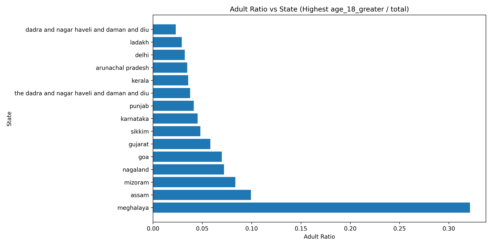

# UIDAI Hackathon — Aadhaar Enrolment Trends & Societal Insights 📊🇮🇳

## 📌 Problem Statement

**UIDAI Hackathon: Unlocking Societal Trends in Aadhaar Enrolment and Updates**

This project analyzes Aadhaar enrolment dataset to identify:

- Meaningful patterns and trends
- Demographic (age-wise) insights
- High-demand and low-demand zones
- Ratio-based priority zones (child/student/adult)
- Workload distribution across states/districts

The goal is to convert data into **actionable insights** for better decision-making and system improvements.

---

## 📁 Project Structure

The project is organized into the following structure:

```
UIDAI Hackathon/
│
├── Datasets/                 # Source CSV datasets
│
├── Graphs/                   # Generated analytics plots (Time series, rankings, heatmaps)
│
├── Output Datasets/          # Processe/Cleaned data CSVs
│
├── Python Scripts/           # Analysis scripts
│   ├── 01_agewise_trend_dashboard.py
│   ├── 02_child_priority_zones.py
│   ├── ... (and other analysis scripts)
│   ├── analysis.py
│   └── state_wise_piechart.py
│
├── State Piecharts/          # State-wise age distribution charts
│
├── Aadhaar-Insights-Web-App/ # React-based Dashboard Web Application
│
├── Images/                   # Screenshots and assets
│
├── run_project.py            # Main runner script for Python analysis
└── requirements.txt          # Python dependencies
```

---

## 🚀 Getting Started

### 🐍 Python Analytics / Data Pipeline

The Python scripts process the raw data to generate insights, CSV reports, and static visualizations.

1.  **Prerequisites**: Python 3.x is required.
2.  **Installation**:
    Install the required dependencies:
    ```bash
    pip install -r requirements.txt
    ```
3.  **Running the Analysis**:
    You can use the interactive runner to execute any of the analysis scripts easily:
    ```bash
    python run_project.py
    ```
    Simply follow the on-screen menu to select the analysis you want to run. The outputs will be generated in `Graphs/` and `Output Datasets/`.

---

### 🌐 Web Application (Interactive Dashboard)

A modern, React-based web dashboard that provides an interactive interface to explore the Aadhaar enrolment data also powered by Gemini AI.

#### Features

- **Interactive Charts**: Visualize enrolment by state, growth trends, and intensity.
- **AI Insights**: Integration with Gemini API to provide intelligent analysis of the data.
- **Dashboard View**: specialized views for Child, Student, and Adult demographics.

#### Setup Instructions

1.  **Navigate to the web app directory**:
    ```bash
    cd Aadhaar-Insights-Web-App
    ```
2.  **Install Dependencies**:
    ```bash
    npm install
    ```
3.  **Configure API Key**:
    Create a file named `.env.local` in the `Aadhaar-Insights-Web-App` directory and add your Gemini API key:
    ```env
    GEMINI_API_KEY=your_actual_api_key_here
    ```
4.  **Run the App**:
    ```bash
    npm run dev
    ```
    Open the local URL shown in the terminal (usually `http://localhost:5173`) to view the dashboard.

#### 📸 Web App Screenshots

|                            Dashboard Overview                            |                              Analytics View                              |
| :----------------------------------------------------------------------: | :----------------------------------------------------------------------: |
|  |  |

|                             Ranking & Trends                             |                               AI Insights                                |
| :----------------------------------------------------------------------: | :----------------------------------------------------------------------: |
|  |  |

---

## ✅ Key Analysis & Features

### 🔹 1) State Name Cleaning & Standardization

Handling spelling variants (e.g., Orissa → Odisha, Pondicherry → Puducherry) to ensure accurate aggregation.

### 🔹 2) State-wise Total Enrolment Intelligence

- Total Aadhaar enrolments per state.
- Ranking of Top 10 and Bottom 10 states.

### 🔹 3) Age-wise Trends (Demographic Shifts)

- **Child (0-5)**: Identification of new birth enrolment gaps.
- **Student (5-17)**: School-driven enrolment hotspots.
- **Adult (18+)**: Workforce and migration-heavy regions.

### 🔹 4) Advanced Visualizations

- **Heatmaps**: State vs Date intensity, State vs Age Group.
- **Ratio Analytics**: Child/Student/Adult ratios per state to identify priority zones.

---

## 📊 Visualizations Generated

### 📈 Trends & Zones

#### Age-wise Enrolment Trend

_Tracking how enrolments across different age groups have evolved over time._



#### Heatmap: State vs Date

_Intensity of enrolments across states over the timeline._



### 🍰 Demographic Distribution (State-wise)

#### Adult Ratio Priority Zones (Top 15)

_States with the highest proportion of adult enrolments._



#### Sample State Distributions

_Age group breakdown for specific regions._

|                                  Delhi                                   |                                  Maharashtra                                   |
| :----------------------------------------------------------------------: | :----------------------------------------------------------------------------: |
|  |  |

---

## 📂 Dataset Details

The dataset contains Aadhaar enrolment counts across age groups with the following columns:

- `date`
- `state`
- `district`
- `pincode`
- `age_0_5` (Child)
- `age_5_17` (Student)
- `age_18_greater` (Adult)

⸻

🧠 Insights & Use Cases (Examples)
	•	States with low child ratio → need newborn enrolment awareness
	•	High student hotspots → likely school-driven Aadhaar camps
	•	High adult ratio zones → workforce migration & job onboarding demand
	•	Daily trends help forecast staffing needs & resource planning
	•	Pie charts summarize demographic focus per state clearly in one image

⸻

✨ Future Improvements
	•	Add interactive dashboard using Streamlit
	•	Add anomaly detection for spike/drop alerts
	•	Add district-level and pincode-level heatmaps
	•	Add forecasting models for future enrolment demand

⸻

👤 Author

Altamish | Ayush Raj Arun
Engineering Student | Data Analytics | UIDAI Hackathon Project
